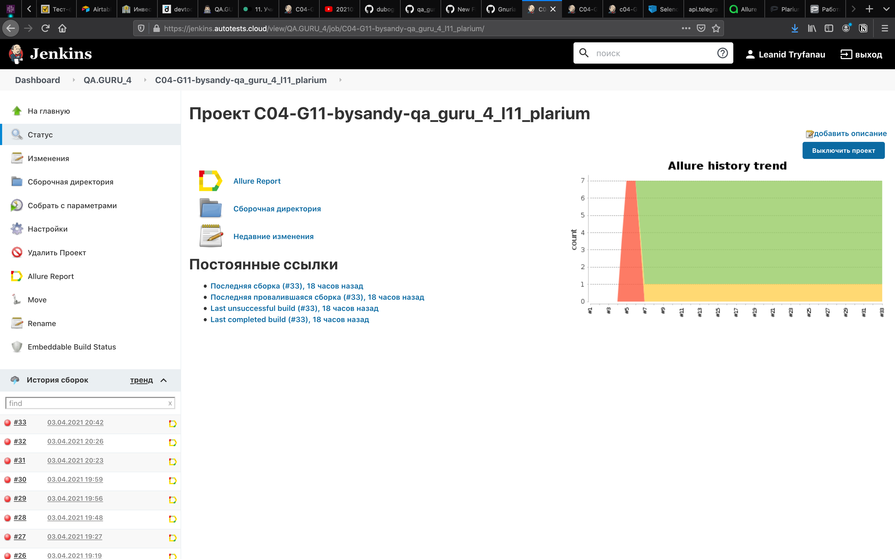
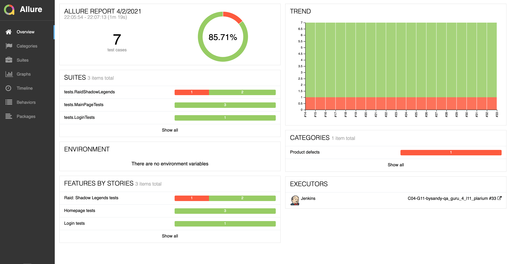
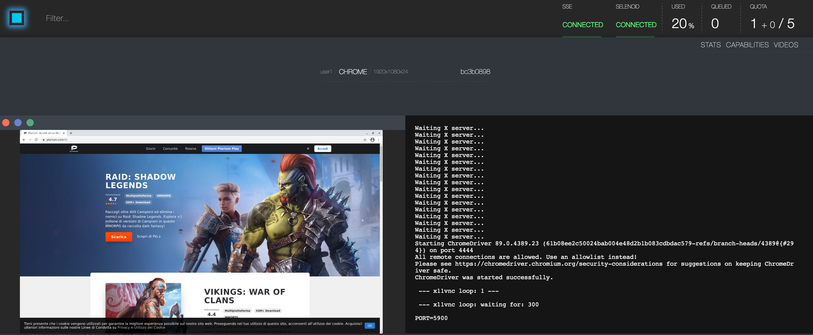
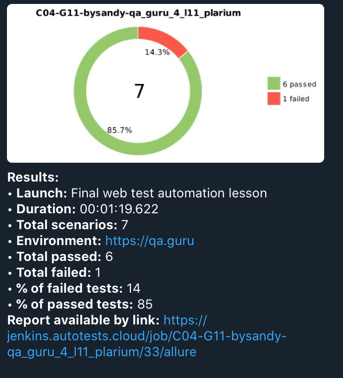

# Test russian version of plarium.com
## UI tests:
:white_check_mark: Login test

:white_check_mark: Main page tests

:white_check_mark: Raid Shadow Legends game's test

## API tests
:negative_squared_cross_mark: Something will be here

## Technology Stack
**Java, Selenide, Rest-Assured, Junit5, Gradle, Allure Reports, Allure TestOps, Jenkins, Selenoid, Telegram Bot, Jira.**

## Screenshots

**Jenkins - it is an open source automation server:**

**Allure Report - it is a flexible lightweight test report tool:**

**Test execution's video**

**Selenide**

**Telegram bot**

